# Django+Vue+Aansible+Mysql前后端分离运维管理系统


2023年当时开发出来了自己的第一版运维管理系统，当时就受到了很多朋友的喜欢，也有很多朋友想把这个项目当做毕业设计，2024年对原来的系统升级，把bootstrap换成了vue，更加的符合现在企业开发，前后端分离模式，非常适合大家用来做毕业设计，这个项目从技术栈到难度到功能点到实用性都适合大家学习，为了开发这个系统，花费了大量时间


## 联系方式：

python_kk（需要代码加我）


## 技术栈：

前端：Vue3

后端：Django3，Restfulapi，drf，mysql

API：ansible


## 项目亮点：

1、后端采用Django开发，简单高效，用的人较少

2、多表关联，外键，多对多

3、echarts可视化

4、ansible


运行截图


首页

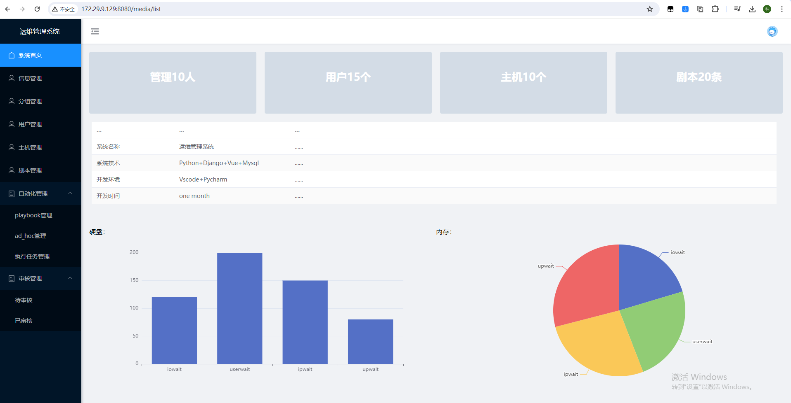


用户信息，管理员和普通用户可以修改密码

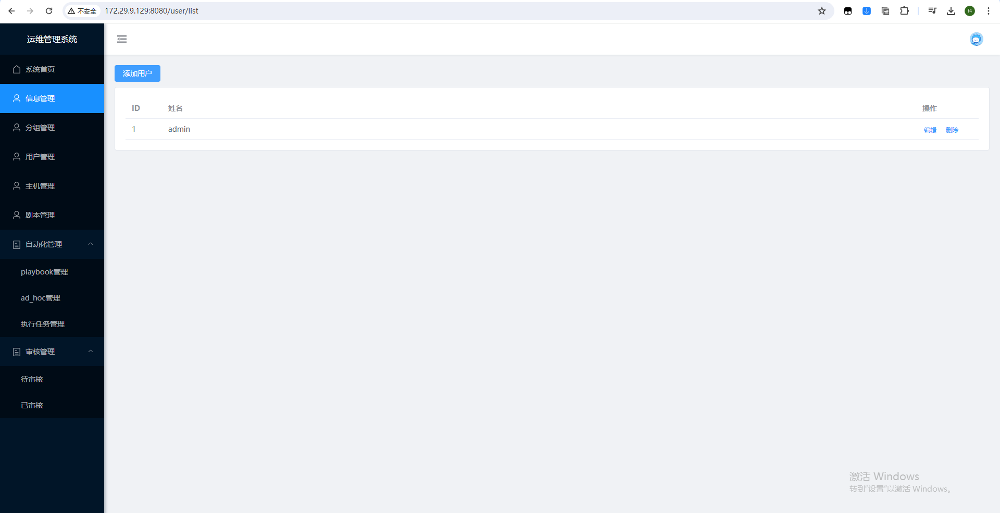


分组管理，可以创建对应项目组

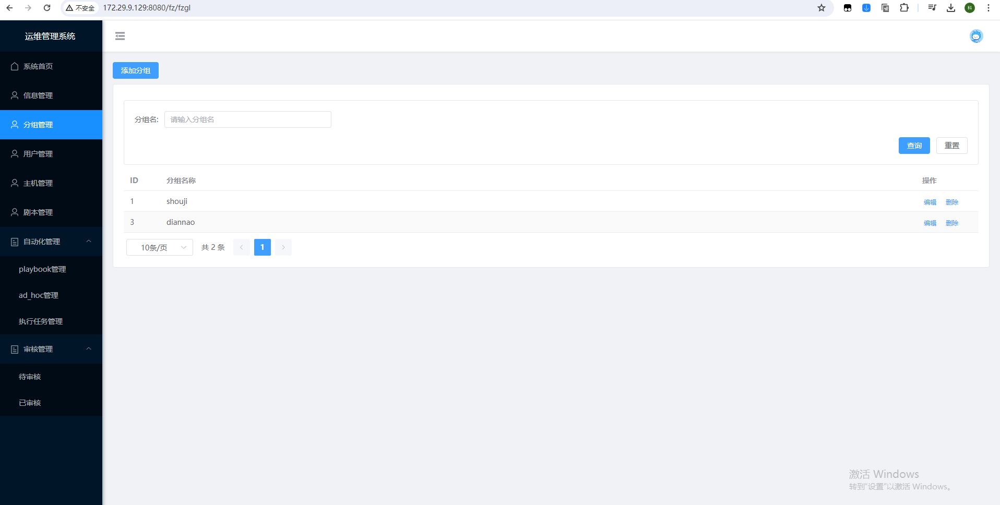


用户增删改查，可以分配组

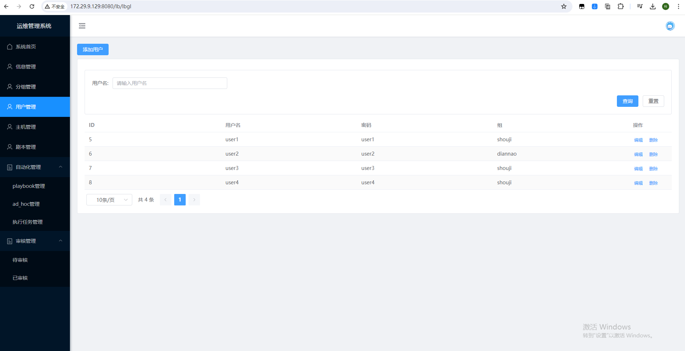


主机增删改查

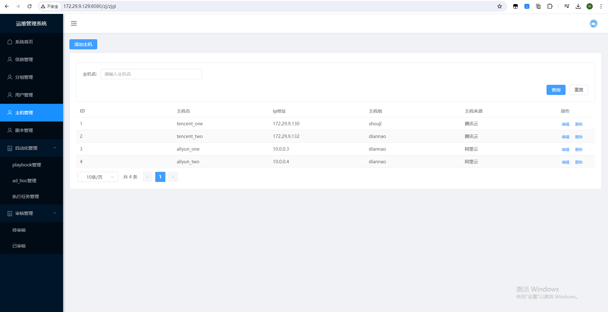


ansible playbook 管理

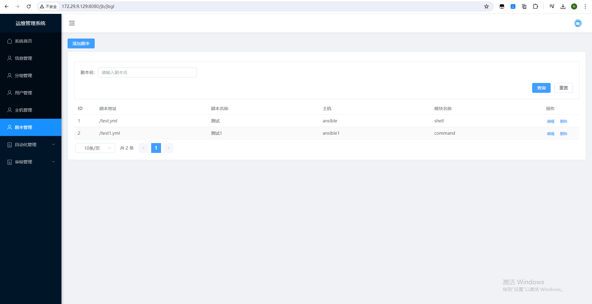


playbook任务创建

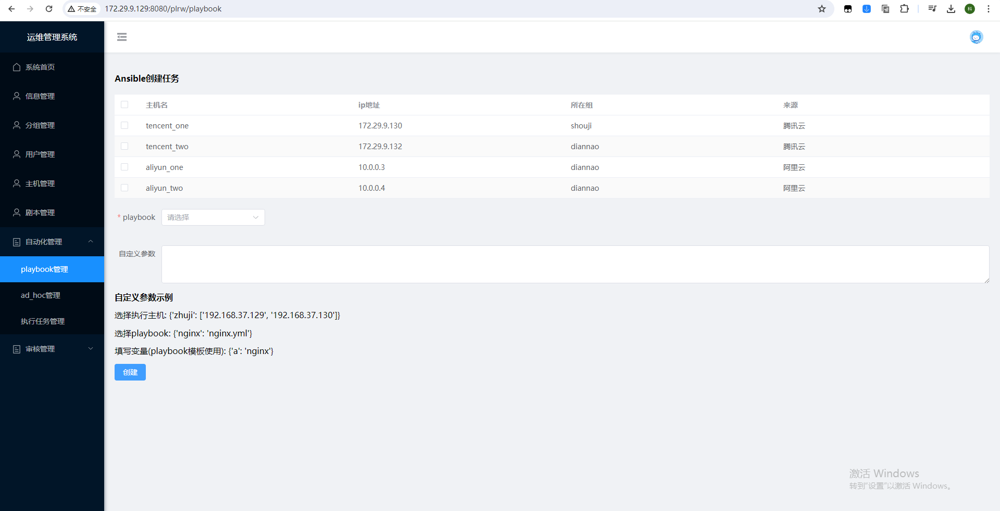


adhoc创建

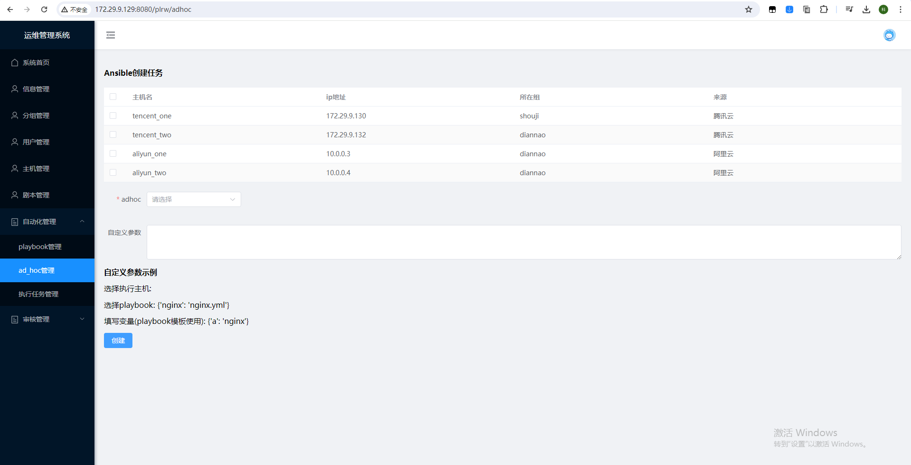


任务执行管理

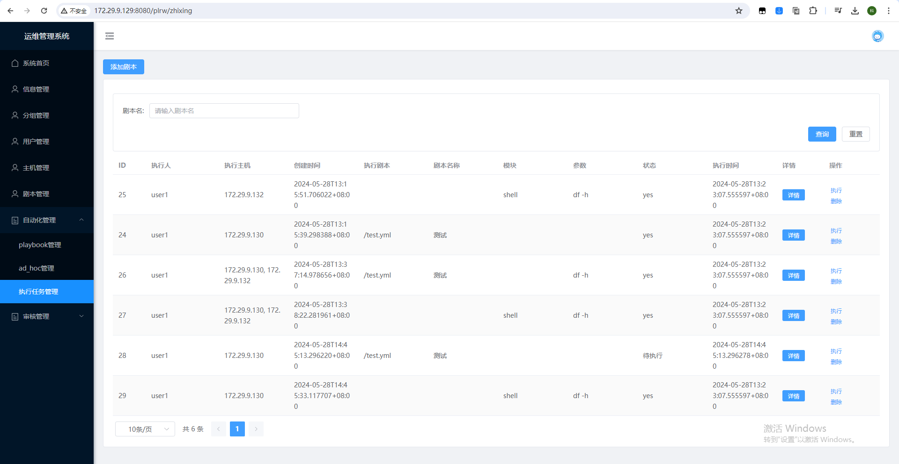


点详情可以看到当前 playbook 和 adhoc 结果

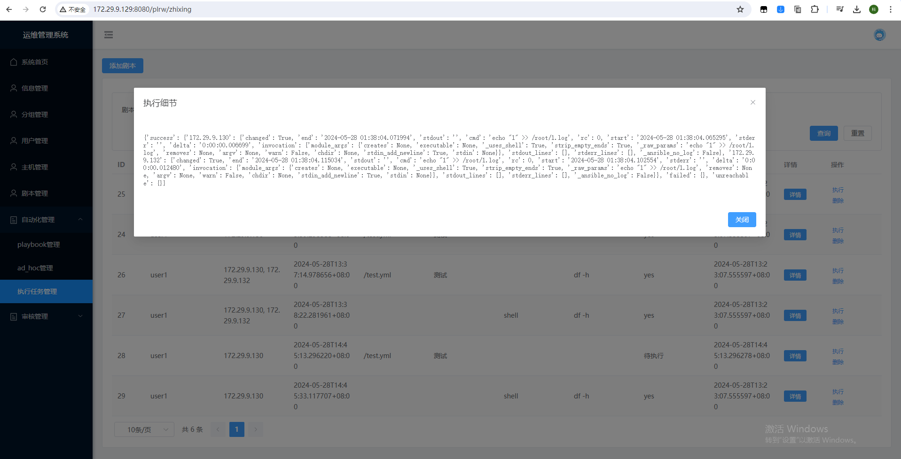


用户可以在这里申请工单

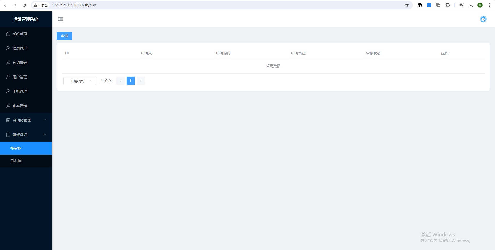


管理员审核

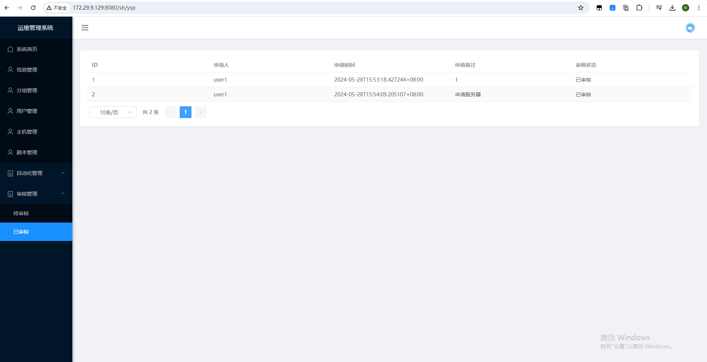


一、前端安装

1、node安装

也可以用压缩包里的 node-v16.18.1-linux-x64.tar.xz

```
wget -c https://nodejs.org/dist/v16.18.1/node-v16.18.1-linux-x64.tar.xz
xz -d node-v16.18.1-linux-x64.tar.xz
tar -xf node-v16.18.1-linux-x64.tar
mv node-v16.18.1-linux-x64 /usr/local/nodejs
```


2、创建软连接

```
ln -s /usr/local/nodejs/bin/node /usr/local/bin/node
ln -s /usr/local/nodejs/bin/npm /usr/local/bin/npm
```


3、编辑环境变量

```
vim /etc/profile

export NODE_HOME=/usr/local/nodejs/
export PATH=$NODE_HOME/bin:$PATH
```


4、测试

```
node -v
npm -v
```


5、设置源

```
npm set registry https://registry.npmmirror.com
```


6、安装cnpm

```
npm install -g cnpm
```


如果是我的项目

```
cd dvyunwei_front

npm run dev
```

如果用我的项目，下面不用操作

7、安装vue-cli

```
cnpm install -g @vue/cli
```


8、建立软连接

```
ln -s /usr/local/nodejs/bin/vue /usr/local/bin/vue
```


9、创建项目

```
vue create test_demo
```


10、运行项目

```
npm run serve
```


二、后端安装

```
yum -y install zlib-devel bzip2-devel openssl-devel ncurses-devel sqlite-devel readline-devel tk-devel gcc make libffi-devel lrzsz unzip python3-devel

systemctl stop firewalld
systemctl disable firewalld

1、安装Python
https://www.python.org/
tar xvf Python-3.7.3.tar.xz
cd Python-3.7.3
./configure --prefix=/usr/python37 && make && make install

ln -s /usr/python37/bin/python3.7 /usr/bin/python37
ln -s /usr/python37/bin/pip3.7 /usr/bin/pip37
```


三、mysql安装

```
步骤一：首先下载mysql的yum源配置
wget http://dev.mysql.com/get/mysql57-community-release-el7-11.noarch.rpm

步骤二：安装mysql的yum源
yum -y install mysql57-community-release-el7-11.noarch.rpm

步骤三：yum方式安装mysql
yum -y install mysql-server  --nogpgcheck
--nogpgcheck  (不校验数字签名)

步骤四：使用mysql
systemctl start mysqld.service
systemctl status mysql.service

cat /var/log/mysqld.log| grep password
ALTER USER USER() IDENTIFIED BY '123456Admin@123';
grant all privileges on *.* to 'root'@'%' identified by '123456Admin@123' with grant option;
flush privileges;
```


四、安装依赖

pip install -r requirement.txt -i https://pypi.tuna.tsinghua.edu.cn/simple

python manage.py runserver 0.0.0.0:8000
